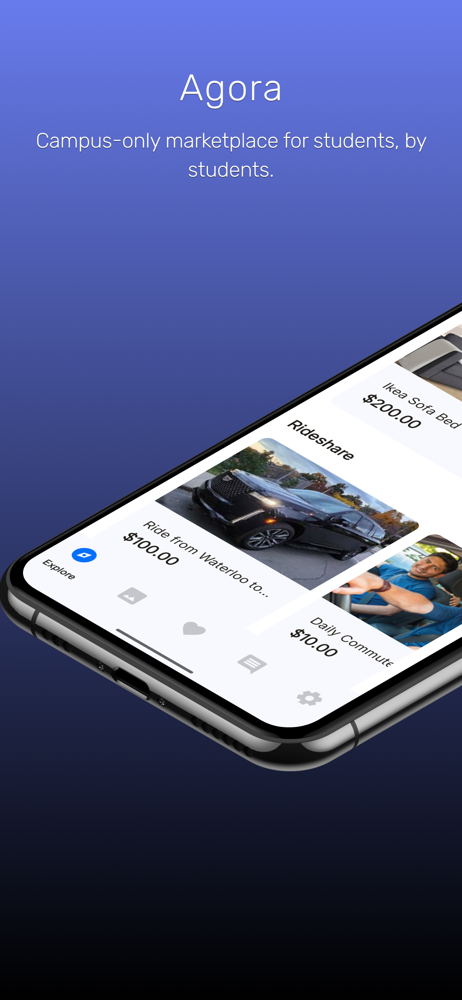
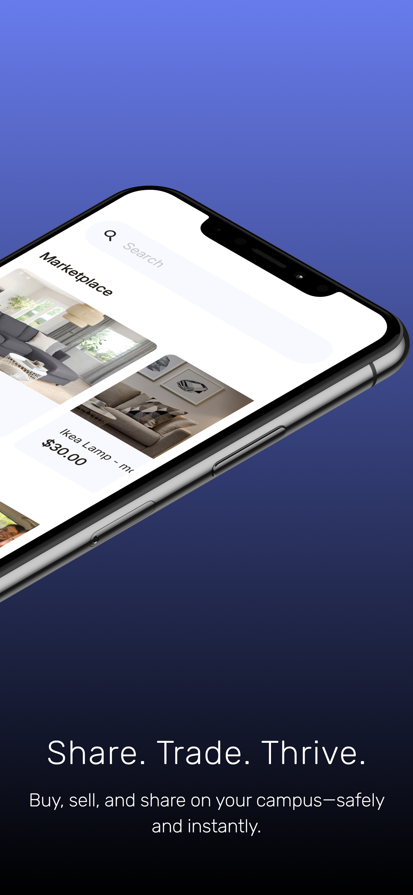
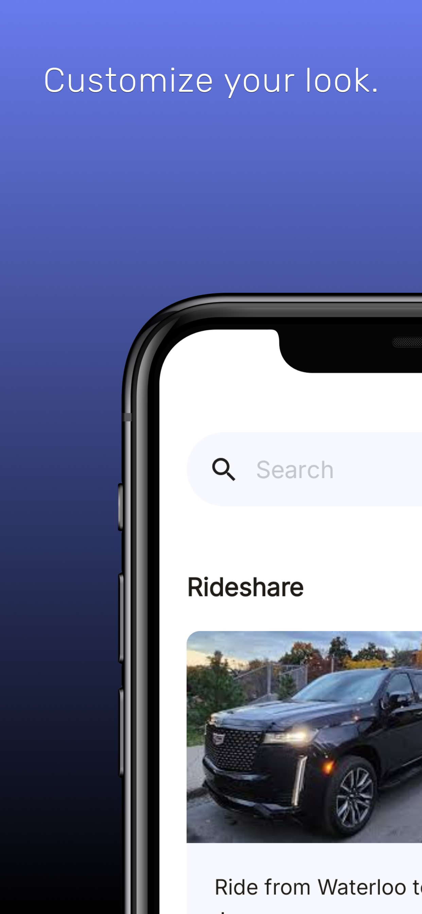

# Agora

## Description

Agora is a campus-exclusive community platform where students can exchange
goods, offer services, and coordinate activities in a trusted environment.
Verified through student email authentication, the platform ensures that all
users are part of the same university, making transactions safer and more
relevant. Students can use Agora to buy and sell items, request or offer rides,
find sublets, and much more. By focusing on campus-specific needs, Agora
provides a streamlined way for students to connect and supptort each other.

  
  
  
  

